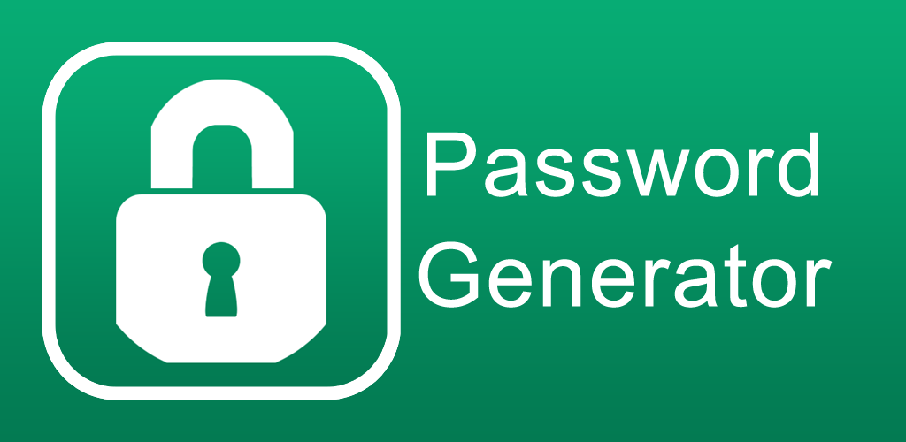

<a id="readme-top"></a>

[![Contributors][contributors-shield]][contributors-url]
[![Forks][forks-shield]][forks-url]
[![Stargazers][stars-shield]][stars-url]
[![Issues][issues-shield]][issues-url]
[![MIT License][license-shield]][license-url]
[![LinkedIn][linkedin-shield]][linkedin-url]


<br />
<div align="center">
  <a href="https://github.com/douglasjnr/password-generator">
    
  </a>

  <h3 align="center">Automated Password Generator</h3>

  <p align="center">
    Python script to automate password generation monthly
    <br />
    <a href="https://github.com/douglasjnr/password-generator"><strong>Explore the docs »</strong></a>
    <br />
    <br />
  </p>
</div>


<!-- TABLE OF CONTENTS -->
<details>
  <summary>Table of Contents</summary>
  <ol>
    <li><a href="about-this-project">About This Project</a></li>
    <li><a href="#features">Features</a></li>
    <li><a href="#tech-stack">Tech Stack</a></li>
    <li><a href="#installation">Installation</a></li>
    <li><a href="#automation-setup">Automation Setup</a></li>
    <li><a href="#files-included">Files Included</a></li>
    <li><a href="#security-notes">Security Notes</a></li>
    <li><a href="#future-improvements">Future Improvements</a></li>
  </ol>
</details>


# :book: About This Project

A secure, encrypted, and automated password generator written in Python that:

  • Generates strong, random passwords monthly

  • Stores them encrypted in an SQLite database

  • Rotates passwords automatically on the 1st of each month

  • Logs all generation activity

  • Easily deployable with scheduled automation on macOS and Windows

<p align="right">(<a href="#readme-top">back to top</a>)</p>


# :atom_symbol: Features

•	AES-encrypted password storage with cryptography (Fernet)

• Automated password rotation using schedule

• Local history of passwords using SQLite

• Log file tracking all activity (password_rotation_log.txt)

• Easily extensible for email alerts or CLI tools

<p align="right">(<a href="#readme-top">back to top</a>)</p>


# :link: Tech Stack

### Language: Python 3
### Libraries: cryptography, schedule, sqlite3, datetime, string, random
### Database: SQLite
### Task Scheduling: schedule library + cron (macOS) / Task Scheduler (Windows)
### Logging: Plaintext .txt file for persistent logs
### Version Control: Git

<p align="right">(<a href="#readme-top">back to top</a>)</p>


# :hammer_and_wrench: Installation

1. Clone the Repository
```sh
git clone https://github.com/yourusername/password-generator.git
cd password-generator
```
2. Install Dependencies
```sh
pip install -r requirements.txt
```
4. Run the Script
```py
python password-generator.py
```
This will start a background scheduler that checks every day at 9:00 AM and generates a password if it's the 1st of the month.

<p align="right">(<a href="#readme-top">back to top</a>)</p>


# :wheel: Automation Setup

### 🧑‍💻 macOS (via cron)

1. Find Python path:
```sh
which python3
```
2. Open crontab:
```sh
crontab -e
```
3. Add this line to run monthly on the 1st at 9:00 AM:
```sh
0 9 1 * * /usr/bin/python3 /path/to/password-generator.py >> /path/to/password_rotation_log.txt 2>&1
```
Replace /path/to/ with your actual file paths.


### 🪟 Windows (via Task Scheduler)

1. Open Task Scheduler and click Create Basic Task

2. Name: Monthly Password Generator

3. Trigger: Monthly → Day 1 → 9:00 AM

4. Action: Start a program

    • Program/script: path to python.exe

    • Arguments: full path to password-generator.py

5. Finish. Your password generator will now run monthly.


## 🧾 Files Included:

|File                   |  Description                                        |
----------------------- | ----------------------------------------------------|
|password-generator.py  | Main script with encryption, database, and scheduler|
|requirements.txt       | Python dependencies                                 |
|.gitignore             | Ensures no sensitive files are pushed               |
|README.md              | You’re reading it!                                  |

⚠️ Sensitive files like passwords.db, secret.key, and logs are ignored from version control.

<p align="right">(<a href="#readme-top">back to top</a>)</p>


# 🛡️ Security Notes

• All passwords are encrypted using Fernet symmetric encryption.

• Your secret key is generated locally and never pushed to GitHub.

• Do not share or upload your secret.key or passwords.db file.

<p align="right">(<a href="#readme-top">back to top</a>)</p>


# 🧰 Future Improvements

• Add email alerts when a new password is generated

• Build a command-line interface (CLI) for manual password access

• Integrate with a password manager or browser extension

<p align="right">(<a href="#readme-top">back to top</a>)</p>


<!-- MARKDOWN LINKS & IMAGES -->
<!-- https://www.markdownguide.org/basic-syntax/#reference-style-links -->
[contributors-shield]: https://img.shields.io/github/contributors/douglasjnr/password-generator.svg?style=for-the-badge
[contributors-url]: https://github.com/douglasjnr/password-generator/graphs/contributors
[forks-shield]: https://img.shields.io/github/forks/douglasjnr/password-generator.svg?style=for-the-badge
[forks-url]: https://github.com/douglasjnr/password-generator/network/members
[stars-shield]: https://img.shields.io/github/stars/douglasjnr/password-generator.svg?style=for-the-badge
[stars-url]: https://github.com/douglasjnr/password-generator/stargazers
[issues-shield]: https://img.shields.io/github/issues/douglasjnr/password-generator.svg?style=for-the-badge
[issues-url]: https://github.com/douglasjnr/password-generator/issues
[license-shield]: https://img.shields.io/github/license/douglasjnr/password-generator.svg?style=for-the-badge
[license-url]: https://github.com/douglasjnr/password-generator/blob/master/LICENSE.txt
[linkedin-shield]: https://img.shields.io/badge/-LinkedIn-black.svg?style=for-the-badge&logo=linkedin&colorB=555
[linkedin-url]: https://www.linkedin.com/in/douglas-junior-tanyanyiwa
[product-screenshot]: images/screenshot.png
[Github.com]: https://img.shields.io/badge/Github-000000?style=for-the-badge&logo=github&logoColor=white
